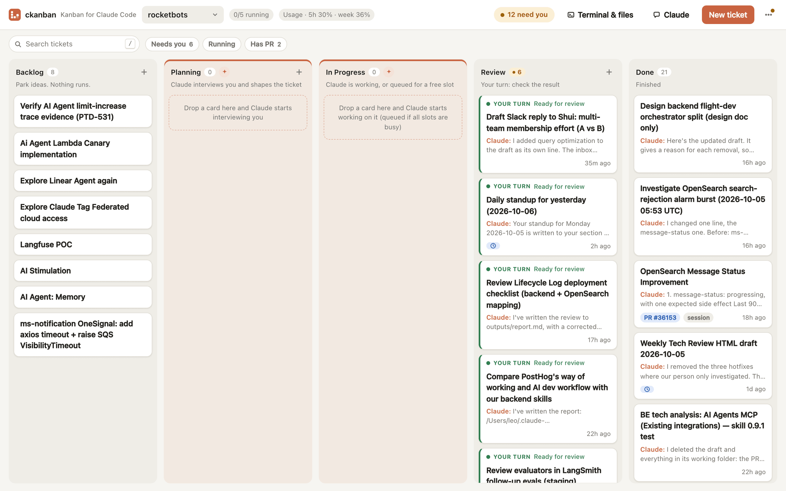
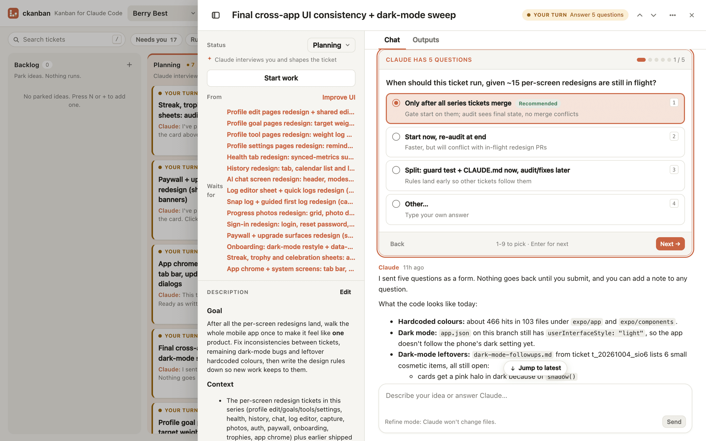
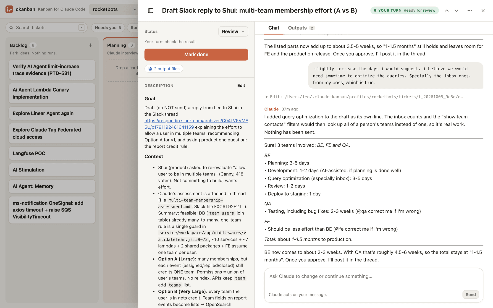
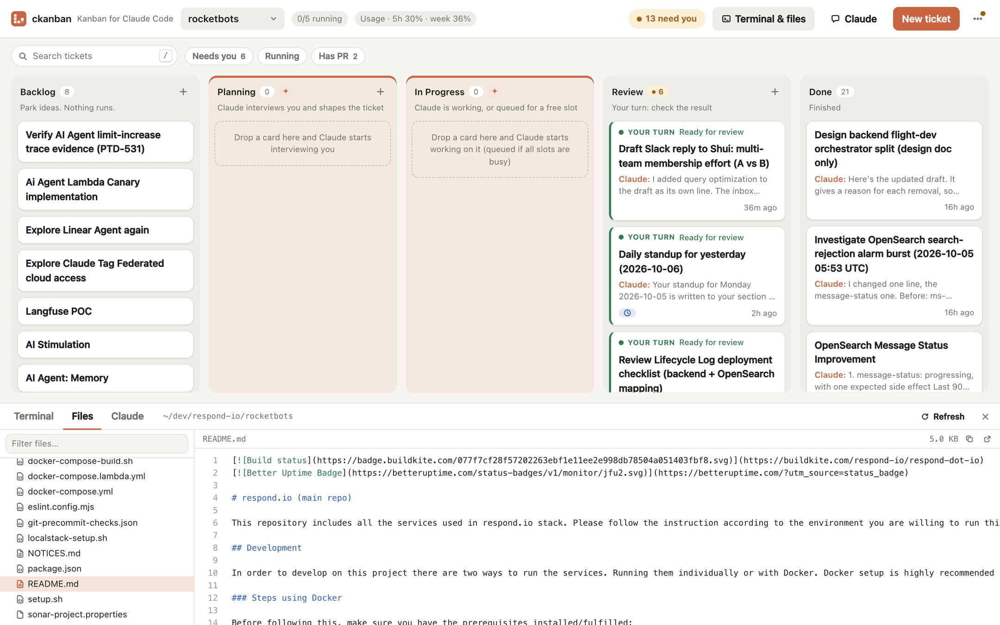
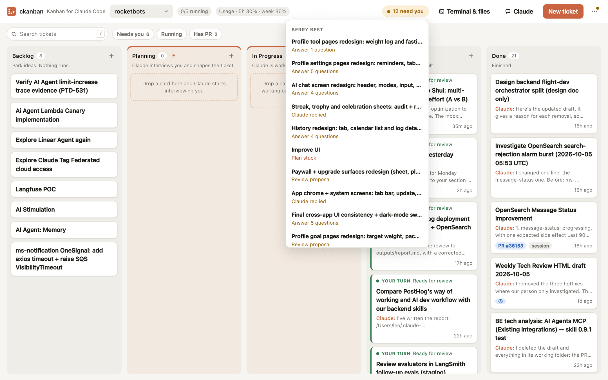

<p align="center">
  
</p>

<h1 align="center">ckanban</h1>

<p align="center"><b>Kanban for Claude Code.</b> Drop a ticket into Ready and a headless Claude Code session picks it up, does the work and moves it to Review, with a GitHub PR when it changed code.</p>

<p align="center">
  
</p>

## Install (macOS)

You need [Claude Code](https://claude.com/claude-code) installed and logged in, plus `git`. For PRs, also install `gh` and run `gh auth login`.

```bash
curl -fsSL https://raw.githubusercontent.com/leoawesome/kanban/main/install.sh | bash
```

This downloads one self-contained binary to `~/.local/bin/ckanban` (no Bun/Node needed), starts it as a background service that launches at login, and opens http://localhost:7777.

Or paste this into Claude Code (or any coding assistant with a terminal):

```text
Install ckanban for me by following
https://raw.githubusercontent.com/leoawesome/kanban/main/docs/install-ai.md
```

The guide walks the assistant through prerequisites, install, PATH, verification and troubleshooting.

Then click the profile menu → **New profile…**, pick a folder you've used Claude Code in, and create a ticket.

## How it works

Columns: **Backlog → Planning → Ready → In Progress → Review → Done**.

- **Backlog**: park ideas. Nothing runs.
- **Planning**: Claude interviews you with a clickable question form, draws HTML mockups for UI work, and proposes a clear ticket. It changes no files.
- **Ready → In Progress**: a headless `claude -p` session works the ticket in its own git worktree (up to 5 at once per board).
- **Review**: check the result, chat with Claude to change it, or merge the PR. Merged PRs move the card to Done.

All data lives in plain files under `~/.claude-kanban/`.

## A closer look

**Planning: Claude interviews you before it starts.** Pick answers, add notes, send once.



**One chat per ticket, like the terminal.** The whole Claude session, with a message box to steer or follow up.



**Terminal & files.** A real shell and a read-only file tree for the board's folder, right under the board.



**"Need you" inbox.** Everything waiting on you, across all boards.



## Features

- **Profiles**: one board per folder; git repos get a worktree and branch per ticket.
- **Auto pickup**: moving a card to Ready starts a run right away, up to max parallel per board.
- **Live activity**: cards show Claude's latest action; the ticket shows the full transcript and cost.
- **Ticket chat**: refine in Planning, steer while running, follow up in Review.
- **Mockups**: UI tickets get HTML mockups you preview and pick from before work starts.
- **Plans**: split a ticket into child tickets that run in dependency order, unattended.
- **Schedules**: recurring tickets on a cron schedule.
- **Connections**: manage your Claude Code MCP servers, like `/mcp`.
- **Terminal handoff**: copy a `claude --resume` command to continue any ticket yourself.
- **Use it from other agents**: Claude Code or Codex can create, start and steer tickets through `ckanban mcp`.
- **PR tracking**: Review cards with a PR are checked via `gh`; merged → Done.

Every feature in detail: **[docs/features.md](docs/features.md)**.

## Everyday commands

```bash
ckanban update      # get the latest release (the board also shows a banner when one is out)
ckanban restart     # restart the background service once active runs finish (--now: at once)
ckanban open        # open the board
ckanban uninstall   # stop and remove the service (your boards in ~/.claude-kanban stay)
```

It runs in the background and survives restarts ([details](docs/features.md#runs-in-the-background-survives-restarts)). Logs: `~/.claude-kanban/daemon.log`. If `ckanban` isn't found, add `export PATH="$HOME/.local/bin:$PATH"` to `~/.zshrc`.

## Use the board from Claude Code / Codex

```bash
ckanban mcp install    # register the MCP server with Claude Code and Codex
```

Then ask, for example, "Scan this repo for unfinished work and create a ticket on my board for each." Tools, CLI equivalents and rules for runs: [docs/features.md](docs/features.md#use-the-board-from-claude-code--codex).

Found a bug? **⋯ → Report a bug** in the header ([how it works](docs/features.md#reporting-bugs)).

## Security

Runs use `--permission-mode bypassPermissions`: Claude can execute any command in the ticket's folder without asking. Only put tickets on boards whose folders you trust Claude to modify.

The server binds to `127.0.0.1` only and rejects requests with a non-localhost `Host` or cross-site `Origin`, so other websites cannot drive it.

## Development

Requires [Bun](https://bun.sh) ≥ 1.3.5 (the embedded terminal uses Bun's built-in PTY; on older Bun everything else works and the terminal says to upgrade).

```bash
bun install && (cd web && bun install)
bun test test          # server tests (use a fake claude binary)
bun run build:web      # build the UI into web/dist
bun run dev            # API + UI on :7777 from source
cd web && bun run dev  # Vite dev server with /api proxy
bun run build:bin      # standalone binaries in dist/ (UI embedded)
```

Run from source as the daemon: `bun src/cli.ts install`. Data layout and env overrides: [docs/features.md](docs/features.md#data-layout).

### Releasing

Bump `version` in `package.json`, then:

```bash
git tag v0.2.0 && git push origin v0.2.0
```

GitHub Actions runs the tests, builds `ckanban-darwin-arm64` / `ckanban-darwin-x64` with the UI embedded, and publishes a GitHub Release. Users get it with `ckanban update`.

Design: `docs/superpowers/specs/2026-09-29-claude-kanban-design.md`.

---

Made by Leo. MIT License, see [LICENSE](LICENSE).
